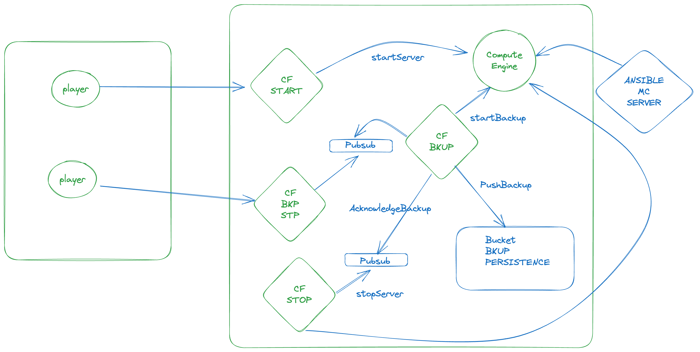

# GCP Hands On Lab



## Aperçu

Ce référentiel contient les codes Terraform et Python nécessaires pour gérer le démarrage et l'arrêt d'une instance Google Compute Engine. Il comprend les configurations pour :

- Les buckets Google Cloud Storage utilisés pour stocker les sources des fonctions Cloud.
- Les fonctions Cloud pour démarrer et arrêter l'instance Compute Engine.
- Les comptes de service pour gérer les permissions nécessaires.
- L'instance Compute Engine qui est gérée par les fonctions Cloud.
- Les objets dans le bucket pour stocker les archives ZIP des fonctions Cloud.

## Prérequis

- Compte Google Cloud Platform avec les permissions nécessaires.
- [Terraform](https://www.terraform.io/downloads.html) installé.
- [Google Cloud SDK](https://cloud.google.com/sdk/docs/install) installé.

## Structure du Référentiel

- `terraform/main.tf`: Fichier Terraform principal contenant la définition des ressources.
- `terraform/variables.tf`: Déclaration des variables utilisées dans les fichiers Terraform.
- `terraform/terraform.tfvars`: Affectation des variables utilisées dans les fichiers Terraform.
- `startFunction/`: Répertoire contenant le code Python pour la fonction de démarrage.
- `stopFunction/`: Répertoire contenant le code Python pour la fonction d'arrêt.

## Utilisation

1. **Configurer les Variables**: Mettez à jour les valeurs selon votre projet au niveau du fichier `terraform.tfvars`.

2. **Initialiser Terraform**: Exécutez la commande suivante pour initialiser Terraform.

   ```bash
   terraform init
   ```

3. **Plannification Terraform**: Exécutez la commande suivante pour plannifier Terraform.

   ```bash
   terraform plan
   ```

4. **Appliquer les changements Terraform**: Exécutez la commande suivante pour appliquer les changements Terraform.

   ```bash
   terraform apply
   ```

5. **Détruire les Ressources**: Si nécessaire, vous pouvez détruire les ressources créées avec la commande suivante.

   ```bash
   terraform destroy
   ```

